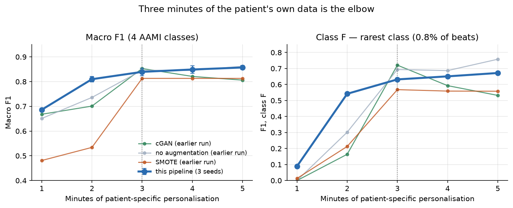

# Patient-Specific ECG Arrhythmia Classification

Classifying individual heartbeats into AAMI arrhythmia classes on the MIT-BIH
Arrhythmia Database, using a compact model that is **personalised to each patient
from a few minutes of their own recording**.

Healthy beat morphology varies enormously between people — one patient's normal
beat can look like another's abnormality — which is why a single global ECG
classifier generalises poorly to a new patient. This project quantifies the
alternative: adapt the model to the individual, and measure how little of their
data is actually needed.



**Three minutes.** Beyond that, additional patient data buys very little.

## Headline result

Evaluated on the 22 held-out DS2 patients, pooled into one confusion matrix.
4 AAMI classes, 5 minutes of personalisation, averaged over 3 seeds.

| | Accuracy | Macro F1 | Cohen's κ |
|---|---|---|---|
| Always predict "normal" | 0.889 | 0.235 | 0.000 |
| Global model, no personalisation | 0.790 | 0.379 | 0.296 |
| **Personalised** | **0.978 ± 0.001** | **0.857 ± 0.009** | **0.889** |

**Personalisation is worth +0.48 macro F1.** The global model on its own scores
*below* the trivial always-normal baseline on accuracy — a direct measurement of
how badly inter-patient morphology shift hurts, and the reason the personalised
approach exists.

Accuracy is close to meaningless on this data: class N is 89% of beats, so
predicting "normal" everywhere already scores 0.889. Macro F1 and κ are the
metrics that carry information.

### Per-class performance

Reported in the standard AAMI format — sensitivity (Se), positive predictive
value (+P) and specificity — so these are directly comparable with the published
literature on this benchmark.

| Class | Beats | Se | +P | Spec | F1 |
|---|---|---|---|---|---|
| N — normal | 36,566 | 0.990 | 0.987 | 0.898 | 0.989 |
| S — supraventricular ectopic | 1,590 | 0.747 | 0.895 | 0.996 | 0.814 |
| V — ventricular ectopic | 2,674 | 0.966 | 0.942 | 0.996 | 0.954 |
| F — fusion | 286 | 0.776 | 0.593 | 0.996 | 0.672 |

```
confusion matrix          predicted
(mean of 3 seeds)      F      N      S      V
                  F  222     33      1     30
                  N  115  36208    132    111
                  S    5    382   1187     16
                  V   34     51      7   2582
```

S and F are the hard classes, as they are throughout this literature: S beats
are morphologically close to N and differ mainly in timing, and F beats are by
definition intermediate between N and V. F is 0.6% of the data.

### What did not help

Every attempt to improve on the compact model made results worse, which is
itself the useful finding. Full study in [`docs/experiments.md`](docs/experiments.md);
all model selection was done on **held-out DS1 patients**, with DS2 used once.

| | Macro F1 (validation, N/S/V) |
|---|---|
| **MLP, 27,972 params** | **0.759** |
| MLP, 80k params | 0.750 |
| 1-D CNN, 163k params | 0.721 |
| MLP, 243k params + dropout | 0.670 |
| Residual CNN, 130k params | 0.620 |
| BiLSTM, 42k params | 0.588 |

Capacity hurts, monotonically. With roughly 370 personalisation beats per
patient there is nothing for a larger model to exploit, and bigger networks fit
the training records harder while generalising worse to unseen ones. Class
weighting and early stopping gained +0.035 on validation and then **lost 0.024
on DS2** — recorded as a negative result rather than quietly dropped.

## Method

Two stages:

1. **Global model** — a small MLP trained on DS1 (22 records).
2. **Personalisation** — for each DS2 patient, a *copy* of that model is
   fine-tuned on that patient's first *n* minutes, then evaluated on the
   remainder of their record.

```
DS1 (22 patients) ──train──> global model
                                  │
DS2 patient, min 0–5 ──fine-tune──┤ (an independent copy per patient)
                                  ▼
DS2 patient, min 5–30 ─────test───> pooled confusion matrix
```

This is the [de Chazal *et al.*](https://doi.org/10.3390/a13040075) inter-patient
protocol. **DS1 and DS2 share no patients**, and within a patient the
personalisation and test windows are disjoint in time. The model does see the
first five minutes of the patient it is tested on — that is the method, not a
leak — but never a beat it is scored on. The guarantee is enforced by tests, not
by convention: see [`tests/test_protocol.py`](tests/test_protocol.py).

## Model

```
input 151  →  Dense 128 (relu)  →  Dense 64 (relu)  →  Dense 4 (softmax)
```

**27,972 parameters.** Input is a 151-sample window centred on the R-peak — 50
samples before, 100 after — at 360 Hz, so 419 ms of single-lead (MLII) signal.

The size is deliberate. The whole pipeline trains and personalises on a **laptop
CPU with no GPU**, which is what makes on-device personalisation practical: a
patient's ECG never has to leave their own hardware to adapt the model to them.
A 28k-parameter network is also small enough to be a credible target for
wearable-class inference, though **inference latency is not benchmarked here** and
no latency claim is made.

Optional variants prepend the interval to the previous beat and the
instantaneous heart rate, giving 152 or 153 inputs — cheap rhythm context that a
single isolated beat cannot carry.

## Data and preprocessing

MIT-BIH Arrhythmia Database: 48 records, 30 minutes each, 360 Hz, 2 leads.

| Stage | Detail |
|---|---|
| Denoising | Baseline wander removed with 200 ms + 600 ms median filters, then a 35 Hz low-pass FIR |
| Resampling | None — native 360 Hz |
| Segmentation | 151-sample window on the annotated R-peak: 50 before, 100 after |
| Beat rejection | Beats whose neighbours sit too close for the window to fit |
| Normalisation | Fit on the personalisation split only, never on test |
| Classes | AAMI F / N / S / V; paced records 102, 104, 107, 217 excluded per AAMI |

Class balance on DS2, and the central difficulty:

| N | V | S | F |
|---|---|---|---|
| 89.0% | 6.5% | 3.7% | 0.8% |

R-peak locations come from the database's expert annotations: this classifies
beats, it does not detect them.

## Usage

```bash
uv venv --python 3.11 && source .venv/bin/activate
uv pip install -e ".[keras,torch,dev]"
```

The data is not in this repository and cannot be — PhysioNet's terms do not
permit redistribution:

```bash
python scripts/download_data.py    # 48 records, ~90 MB
python scripts/build_csv.py        # derive per-record CSVs
```

Then:

```bash
pytest                                    # 41 tests (15 skip without data)
python scripts/train.py --seed 12         # train, personalise, score
python scripts/sweep.py --seeds 12 13 14  # the personalisation curve
```

## Layout

```
src/ecg/
  config.py         every tunable, DS1/DS2 record lists, class order
  data.py           record loading
  preprocessing.py  FIR / median / wavelet denoising, scaling
  segmentation.py   R-peak windowing, AAMI labelling, feature assembly
  balance.py        oversampling, SMOTE, shift augmentation
  models.py         Keras architectures
  cgan.py           conditional GAN for minority-class synthesis (PyTorch)
  train.py          global training, patient personalisation
  evaluate.py       metrics and confusion matrices
  viz.py            plotting
scripts/            download_data, build_csv, train, sweep, evaluate
notebooks/          signal exploration, results
tests/              41 tests: regression, protocol and leakage guards
docs/experiments.md model selection study
```

## Reproducibility

`seed_everything()` seeds Python, NumPy, TensorFlow and PyTorch, and every
parameter lives in a frozen `Config`. The same seed gives byte-identical
metrics and confusion matrices.

Determinism is not stability, though: *different* seeds move macro F1 by up to
0.02. Every figure reported here is a 3-seed mean, and single-seed numbers
should not be compared at three decimal places.

Preprocessing is pinned by regression tests that assert an MD5 over the
segmented beat tensor, so a change to filtering or windowing fails loudly
instead of quietly costing F1.

## Citation

If you use the data, cite the database and PhysioNet:

> Moody GB, Mark RG. The impact of the MIT-BIH Arrhythmia Database.
> *IEEE Eng in Med and Biol* 20(3):45-50 (2001).

> Goldberger A, et al. PhysioBank, PhysioToolkit, and PhysioNet: Components of a
> New Research Resource for Complex Physiologic Signals.
> *Circulation* 101(23):e215-e220 (2000).

## License

MIT — see [LICENSE](LICENSE). The MIT-BIH data is separately licensed by
PhysioNet under the Open Data Commons Attribution License v1.0.
